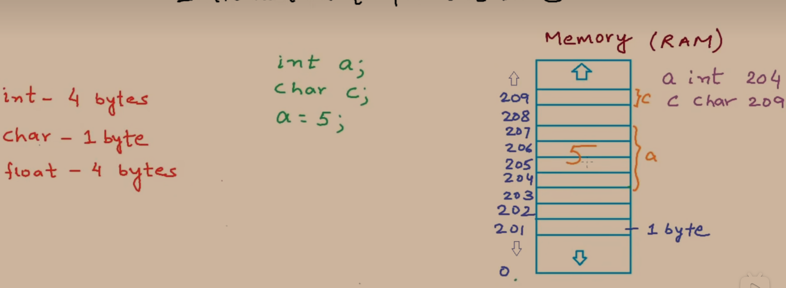
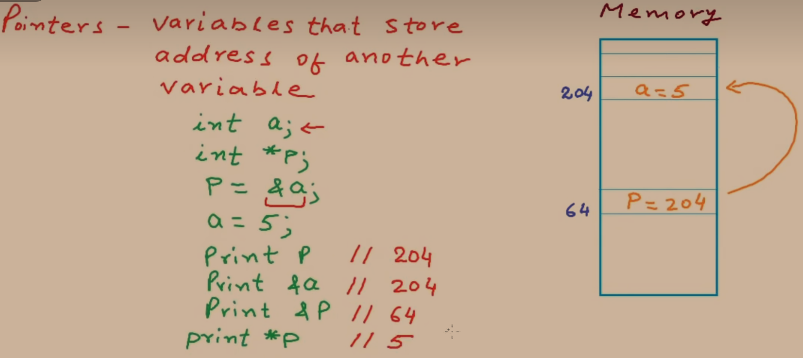
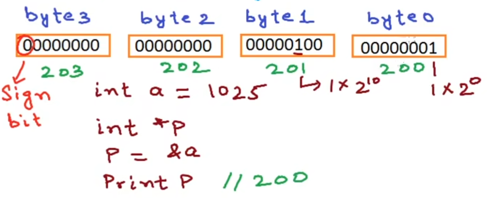
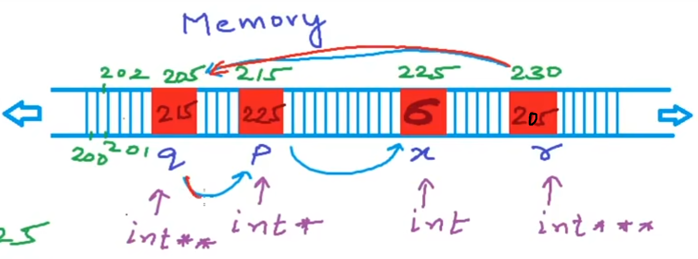

## 什么是指针

**指针是一个变量，用来存放其他变量在内存中的地址。**

指针本身也占用内存空间，在 64 位系统中，指针占 **8 个字节**。

```c
#include <stdio.h>

int main(void) {
    int* pointer;
    printf("%d\n", sizeof(pointer));  // 输出: 8
    return 0;
}
```

## 变量在内存中的表示

每个变量在内存中都有唯一的地址，通过 `&` 取地址运算符和 `*` 解引用运算符可以操作地址与值。

```c
#include <stdio.h>

int main(void) {
    int a;
    int* p;
    p = &a;    // p 存放 a 的地址
    a = 5;

    printf("%d\n", p);   // a 的地址，如 6422036
    printf("%d\n", &a);  // 同上
    printf("%d\n", a);   // 5
    printf("%d\n", *p);  // 解引用，输出 5
    return 0;
}
```



::: note 关键理解
- `&a` 获取变量 a 的**内存地址**
- `*p` 对指针 p 进行**解引用**，获取该地址上存储的值
- 通过指针修改变量的值：`*p = 6` 等价于 `a = 6`
:::

```c
#include <stdio.h>

int main(void) {
    int a = 5;
    int* p = &a;
    *p = 6;              // 通过指针修改 a 的值
    printf("%d\n", a);   // 输出: 6

    // 指针算术：p + 1 指向下一个 int 类型的位置
    printf("%d\n", p);     // 地址如 6422036
    printf("%d\n", p + 1); // 地址如 6422040（相差 4 字节）
    return 0;
}
```



> [!NOTE]
> `*p` 解引用运算符，获取指针 `p` 所指向的地址上存储的值。

## 不同类型的指针转换

指针的类型决定了指针算术运算时的步长。不同类型之间的指针可以通过强制类型转换相互转换。

```c
#include <stdio.h>

int main(void) {
    int a = 1025;
    int* p = &a;
    printf("int类型所占字节数：%d\n", sizeof(int));  // 4
    printf("p的地址：%d, *p的值：%d\n", p, *p);      // 1025

    // 强制转换为 char* 类型
    char* p0 = (char*)p;
    printf("char类型所占字节数：%d\n", sizeof(char)); // 1
    printf("p0的地址：%d, *p0的值：%d\n", p0, *p0);  // 1
    printf("p0 + 1的地址：%d, *(p0 + 1)的值：%d\n", p0 + 1, *(p0 + 1)); // 4
    return 0;
}
```

::: note 原理说明
`int a = 1025` 在内存中占 4 个字节：

```
地址:   [p0]    [p0+1]  [p0+2]  [p0+3]
值:    00000001 00000100 00000000 00000000  → int 类型 1025
       ↑
       p0 = (char*)p 只指向第一个字节
```

- `char` 类型占 1 个字节，`*p0` 读取的是第一个字节的值：`00000001` = **1**
- `*(p0 + 1)` 读取的是第二个字节的值：`00000100` = **4**
:::



> [!TIP]
> 指针类型决定了指针加减操作时移动的字节数：
> - `int* p` → `p + 1` 移动 4 个字节
> - `char* p` → `p + 1` 移动 1 个字节

## 指向指针的指针（多级指针）

指针可以指向另一个指针，形成多级间接引用。

```c
#include <stdio.h>

int main(void) {
    int x = 5;
    int* p = &x;
    int** q = &p;     // q 指向指针 p
    int*** r = &q;    // r 指向指针 q

    printf("*p = %d\n", *p);      // 5
    printf("*q = %d\n", *q);      // p 的地址（即 &x）
    printf("**q = %d\n", **q);    // 5
    printf("**r = %d\n", **r);    // 同 *q，即 p 的地址
    printf("***r = %d\n", ***r);  // 5

    // 通过多级指针修改变量
    ***r = 10;
    printf("x = %d\n", x);        // 10

    **q = *p + 2;
    printf("x = %d\n", x);        // 12
    return 0;
}
```



::: warning 注意
多级指针虽然灵活，但过多的间接引用会降低代码可读性，**一般不超过三级**（`***`）。
:::

## 代码文件对照

| 文件名 | 对应内容 |
|--------|----------|
| pointer01.c | 指针基本使用：`&` 和 `*` 运算符 |
| pointer02.c | 通过指针修改变量值，指针算术 |
| pointer03.c | 不同类型指针转换（`int*` → `char*`） |
| pointer04.c | 多级指针（`int**`, `int***`） |
