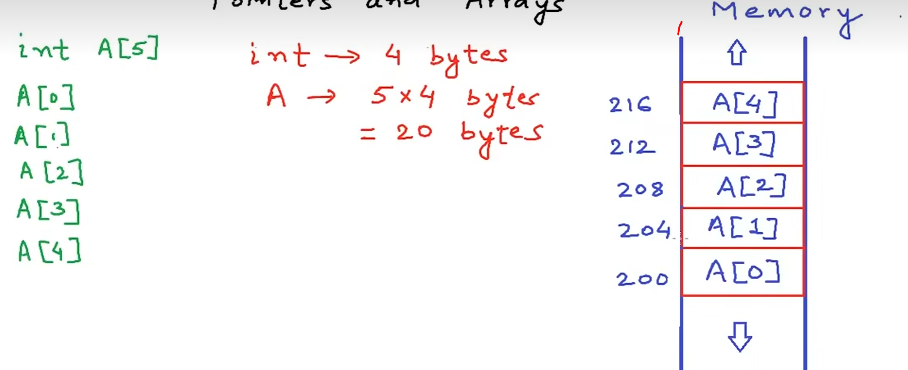
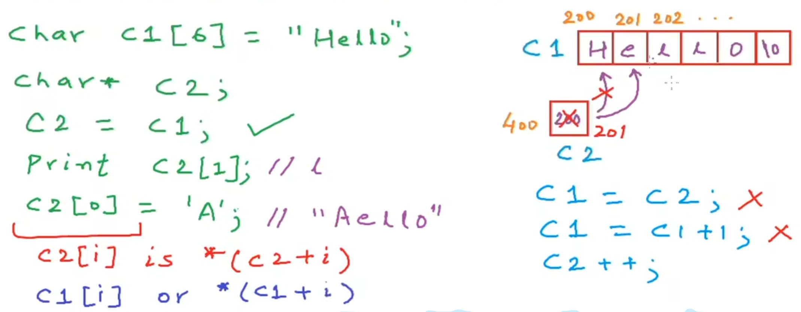
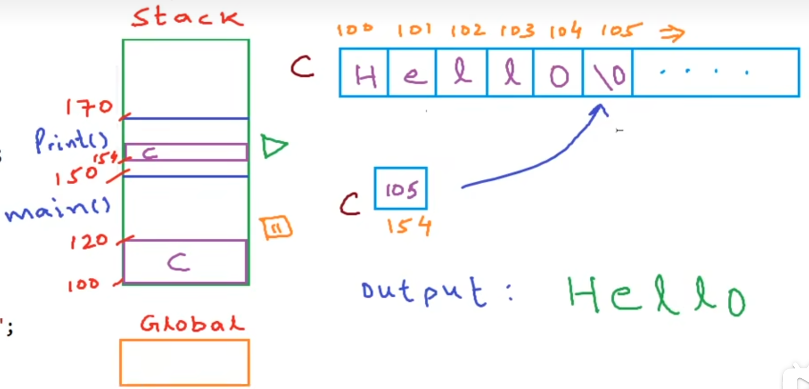

## 数组名即首地址

在 C 语言中，数组名代表**数组的首地址**，可以直接像指针一样使用。

```c
#include <stdio.h>

int main(void) {
    int a[5] = {8, 11, 70, 48, 52};

    printf("数组a的首地址是：%d\n", a);        // 首地址
    printf("数组a的第一个值是：%d\n", *a);      // 8

    printf("数组a的第二个元素的地址是：%d\n", a + 1);  // 首地址 + 4
    printf("数组a的第二个元素的值是：%d\n", *(a + 1)); // 11

    // 等价写法
    printf("数组a的第三个元素的地址是：%d\n", &a[2]);
    printf("数组a的第三个元素的值是：%d\n", a[2]);     // 70
    return 0;
}
```

核心等价关系：

| 表达式 | 含义 |
|--------|------|
| `a` | 数组首地址（等价于 `&a[0]`） |
| `*a` | 数组第一个元素的值（等价于 `a[0]`） |
| `a + i` | 第 i 个元素的地址（等价于 `&a[i]`） |
| `*(a + i)` | 第 i 个元素的值（等价于 `a[i]`） |



## 数组作为函数参数

C 语言中数组作为函数参数时，**总是传引用**。编译器不会拷贝整个数组，而是创建一个指向数组首地址的指针。

```c
#include <stdio.h>

// int a[] 等价于 int* a，二者完全一样
int array(int a[], int size) {
    int sum = 0;
    printf("in array, size of a = %d, size of a[0] = %d\n", sizeof(a), sizeof(a[0]));
    for (int i = 0; i < size; i++) {
        sum += a[i];  // a[i] = *(a + i)
    }
    return sum;
}

int main(void) {
    int a[5] = {1, 2, 3, 4, 5};
    int size = sizeof(a) / sizeof(a[0]);
    int total = array(a, size);
    printf("sum = %d\n", total);

    // 注意：main 中的 sizeof(a) 是数组总大小
    printf("in main, size of a = %d, size of a[0] = %d\n", sizeof(a), sizeof(a[0]));
    return 0;
}
```

::: warning 特别注意
```
in array,  size of a = 8,   size of a[0] = 4    ← 此时 a 是指针（8 字节）
in main,   size of a = 20,  size of a[0] = 4    ← 此时 a 是数组（20 字节）
```
**在函数内部，数组参数已退化为指针**，无法用 `sizeof` 获取数组长度，必须额外传入 `size` 参数。
:::

### 练习：数组乘二

```c
#include <stdio.h>

void arraytwo(int* a) {
    for (int i = 0; i < 5; i++) {
        a[i] = a[i] * 2;
    }
}

int main(void) {
    int a[5] = {1, 2, 3, 4, 5};
    arraytwo(a);
    for (int i = 0; i < 5; i++) {
        printf("%d\t", a[i]);  // 2  4  6  8  10
    }
    return 0;
}
```

## 字符数组

字符数组以空字符 `\0` 结尾，声明时空间必须 `>=` 字符数量 + 1。

```c
#include <stdio.h>

int main(void) {
    char C1[4];          // 空间不足，缺少 \0 的位置
    C1[0] = 'j';
    C1[1] = 'o';
    C1[2] = 'h';
    C1[3] = 'n';
    printf("%s\n", C1);  // 输出乱码（缺少终止符）

    char C[5];           // 正确：5 = 4字符 + 1个\0
    C[0] = 'j';
    C[1] = 'o';
    C[2] = 'h';
    C[3] = 'n';
    C[4] = '\0';         // 手动添加终止符
    printf("%s\n", C);   // 输出: john
    return 0;
}
```



### 遍历字符数组的两种写法

::: code-tabs
@tab:active 下标法
```c
void printElement(char* a) {
    int i = 0;
    while (a[i] != '\0') {
        printf("%c\t", a[i]);
        i++;
    }
    printf("\n");
}
```

@tab 指针法
```c
void printElement(char* a) {
    while (*a != '\0') {
        printf("%c\t", *a);
        a++;  // 移动指针到下一个字符
    }
    printf("\n");
}
```
:::

```c
int main(void) {
    char a[20] = "hello";
    printElement(a);
    return 0;
}
// 输出: h  e  l  l  o
```



> [!NOTE]
> 使用 `const char* a` 可以将函数参数设为**只读**，防止误修改：
> ```c
> void printElement(const char* a)  // 只可读取，不能修改
> ```

## 代码文件对照

| 文件名 | 对应内容 |
|--------|----------|
| pointer06.c | 数组名即首地址，`a` 与 `&a[0]` |
| pointer07.c | 数组作为函数参数（退化指针 + sizeof 差异） |
| pointer07-1.c | 练习：数组乘二 |
| pointer08.c | 字符数组与 `\0` 终止符 |
| pointer09.c | 两种方式遍历字符数组 |
