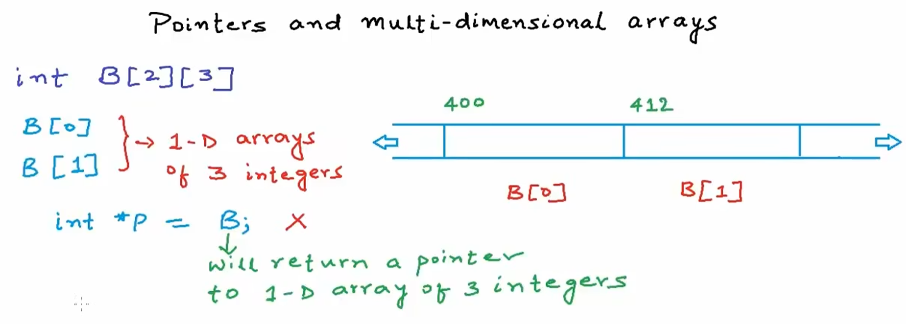

## 二维数组的内存布局

二维数组本质上是**一维数组的数组**。例如 `int a[2][3]` 包含 2 个大数组，每个大数组包含 3 个 int 元素。

```c
#include <stdio.h>

int main(void) {
    int a[2][3] = {2, 3, 6, 4, 5, 8};

    printf("a[0][1] = %d\n", a[0][1]);  // 3

    // &a 和 &a[0] 数值相同，但类型不同
    printf("&a  = %d\n", &a);    // 指向整个二维数组，类型 int (*)[3]
    printf("&a[0] = %d\n", &a[0]); // 指向第一行，类型 int (*)[3]
    return 0;
}
```



::: code-tabs
@tab:active 地址关系

```c
// a  -> &a[0]  （指向第一行）
printf("%d\t", a);     // 首地址
printf("%d\n", &a[0]); // 同上

// *a -> a[0] -> &a[0][0]  （指向第一个元素）
printf("%d\t", *a);      // 解引用得到 a[0]（也是地址）
printf("%d\t", a[0]);    // a[0] 作为数组名返回首地址
printf("%d\n", &a[0][0]);// 第一个元素的地址

// a+1 -> &a[1]  （指向第二行，偏移 12 字节）
printf("%d\t", a+1);
printf("%d\n", &a[1]);

// *(a+1) -> a[1] -> &a[1][0]  （指向第二行第一个元素）
printf("%d\t", *(a+1));
printf("%d\t", a[1]);
printf("%d\n", &a[1][0]);
```

@tab 测试
```c
// 综合测试：*(*a+1) 等于多少？
// *a = a[0] = &a[0][0]
// *a+1 = &a[0][1]
// *(*a+1) = a[0][1] = 3
printf("%d\n", *(*a+1));  // 3
```
:::

### 核心公式

多维数组中，以下公式成立：

```c
a[i][j] = *(a[i] + j) = *(*(a + i) + j)
```


## 数组指针

对于二维数组 `int a[2][3]`，不能直接用 `int* p = a`，因为 `a` 返回的是一个指向**包含 3 个 int 的一维数组**的指针，而不是指向单个 int 的指针。

```c
int a[2][3] = {{2, 3, 6}, {4, 5, 8}};

// 正确声明方式：
int (*p)[3] = a;  // p 是指向包含 3 个 int 的数组的指针
```

::: tip 理解
- `int (*p)[3]` — p 是一个指针，指向一个包含 3 个 int 的数组
- `int* p[3]` — p 是一个数组，包含 3 个 int* 指针（**完全不同**）
:::

## 多维数组作为函数参数

向函数传递不同维度的数组时，参数声明方式不同：

::: code-tabs
@tab:active 一维数组
```c
void Func(int *A) {        // 或 int A[]
}
```

@tab 二维数组
```c
void Func(int (*A)[3]) {   // 或 int A[][3]
}
```

@tab 三维数组
```c
void Func(int (*A)[2][2]) {  // 或 int A[][2][2]
}
```
:::

```c
#include <stdio.h>

int main() {
    int A[2] = {1, 2};
    int B[2][3] = {{2, 4, 6}, {5, 7, 8}};
    int C[3][2][2] = {
        {{2, 5}, {7, 9}},
        {{3, 4}, {6, 1}},
        {{0, 8}, {11, 13}}
    };
    // Func(X)
    return 0;
}
```


> [!NOTE]
> 多维数组传参时，**只有第一维可以省略**，其余维度必须明确指定。
> - 正确：`void Func(int A[][3])`
> - 正确：`void Func(int A[][2][2])`
> - 错误：`void Func(int A[][])`

## 总结对比

| 数组维度 | 声明示例 | 函数参数写法 | 访问公式 |
|----------|----------|-------------|----------|
| 一维 | `int a[5]` | `int* a` 或 `int a[]` | `a[i]` |
| 二维 | `int a[2][3]` | `int (*a)[3]` 或 `int a[][3]` | `a[i][j]` = `*(*(a+i)+j)` |
| 三维 | `int a[3][2][2]` | `int (*a)[2][2]` 或 `int a[][2][2]` | `a[i][j][k]` |

## 代码文件对照

| 文件名 | 对应内容 |
|--------|----------|
| pointer10.c | 二维数组地址关系、数组指针 `int (*p)[3]` |
