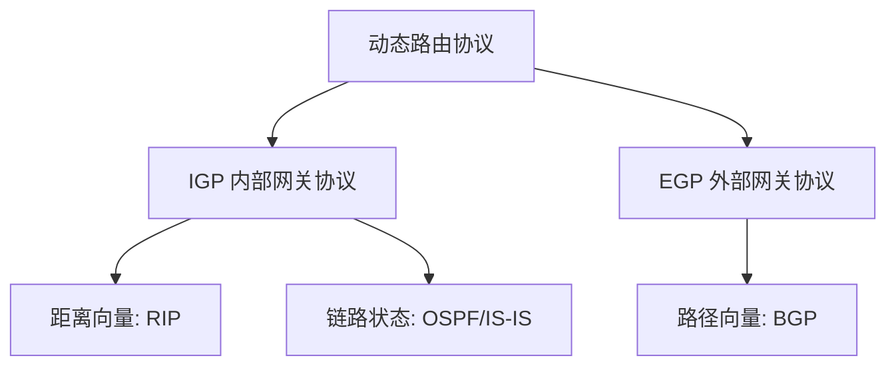

## 概述

网络层（Network Layer）是 OSI 模型第三层、TCP/IP 模型的核心层，负责**端到端的数据传输**和**路由选择**，屏蔽底层物理网络（以太网、Wi-Fi、4G 等）的差异，为上层（传输层）提供统一的逻辑通信服务。

::: tip 核心功能
- **逻辑寻址**：IP 地址体系，标识网络中的主机
- **路由选择**：为数据包选择最佳路径到达目的地
- **分组转发**：将数据包从输入链路口转发到输出链路口
- **异构网络互连**：连接不同类型的物理网络
:::

---

## 一、IP 地址体系发展

### 1.1 分类地址（Classful Addressing）

早期的 IP 地址采用**分类编址**，将 32 位 IPv4 地址分为五类：

| 类别 | 前缀位 | 首字节范围 | 网络号位数 | 主机号位数 | 每网络主机数 | 用途 |
|:----:|:------:|:----------:|:----------:|:----------:|:------------:|:----:|
| A 类 | 0 | 0~127 | 8 位 | 24 位 | 16,777,214 | 大型网络 |
| B 类 | 10 | 128~191 | 16 位 | 16 位 | 65,534 | 中型网络 |
| C 类 | 110 | 192~223 | 24 位 | 8 位 | 254 | 小型网络 |
| D 类 | 1110 | 224~239 | — | — | — | 组播 |
| E 类 | 1111 | 240~255 | — | — | — | 保留/实验 |

::: warning 分类地址的缺陷
1. **地址浪费严重**：一个 C 类只有 254 个地址，一个 B 类却多达 65,534 个。中型企业申请 B 类用不完，C 类又不够用
2. **路由表膨胀**：每个 A/B/C 类网络都需要一条路由表条目，核心路由器需要维护数十万条路由
3. **缺乏灵活性**：无法根据实际需求灵活分配不同大小的地址块
:::

### 1.2 子网划分（Subnetting）

子网划分从**主机号高位借位**作为子网号，将一个 IP 网络划分为多个更小的子网。

#### 子网掩码

子网掩码是一个 32 位的二进制数，用 **1** 表示网络号 + 子网号位，**0** 表示主机号位。通过**按位与运算**提取网络地址：

```
IP 地址：   192.168.1.139  →  11000000.10101000.00000001.10001011
子网掩码：  255.255.255.192 →  11111111.11111111.11111111.11000000
按位与：    192.168.1.128  →  11000000.10101000.00000001.10000000  ← 子网地址
```

#### 示例：C 类 192.168.1.0/24 → 4 个子网

从主机号借 **2 位**作为子网号：

| 子网号(二进制) | 子网地址 | 可用主机范围 | 广播地址 |
|:--------------:|:---------:|:------------:|:--------:|
| 00 | 192.168.1.0 | 192.168.1.1 ~ 192.168.1.62 | 192.168.1.63 |
| 01 | 192.168.1.64 | 192.168.1.65 ~ 192.168.1.126 | 192.168.1.127 |
| 10 | 192.168.1.128 | 192.168.1.129 ~ 192.168.1.190 | 192.168.1.191 |
| 11 | 192.168.1.192 | 192.168.1.193 ~ 192.168.1.254 | 192.168.1.255 |

- **子网掩码**：255.255.255.192（即 /26）
- **每个子网主机数**：2⁶ − 2 = 62（全 0 网络地址 + 全 1 广播地址不可用）

::: note 子网掩码速查表
| CIDR | 掩码 | 子网数(C类) | 每子网主机数 |
|:----:|:----:|:----------:|:----------:|
| /25 | 255.255.255.128 | 2 | 126 |
| /26 | 255.255.255.192 | 4 | 62 |
| /27 | 255.255.255.224 | 8 | 30 |
| /28 | 255.255.255.240 | 16 | 14 |
| /29 | 255.255.255.248 | 32 | 6 |
| /30 | 255.255.255.252 | 64 | 2 |
:::

### 1.3 VLSM（可变长子网掩码）

**VLSM**（Variable Length Subnet Mask）允许在一个主网络中使用**不同长度**的子网掩码，按需分配地址空间，显著提高 IP 地址利用率。

#### VLSM 示例

公司有 4 个部门，需求各不相同：

| 部门 | 需要主机数 | 子网掩码 | 可用主机数 | 地址块 |
|:----:|:---------:|:--------:|:----------:|:------:|
| 研发部 | 50 | /26 (255.255.255.192) | 62 | 192.168.1.0/26 |
| 市场部 | 25 | /27 (255.255.255.224) | 30 | 192.168.1.64/27 |
| 财务部 | 12 | /28 (255.255.255.240) | 14 | 192.168.1.96/28 |
| 行政部 | 2 | /30 (255.255.255.252) | 2 | 192.168.1.112/30 |

不使用 VLSM 时，所有子网必须用同样的掩码（如 /26），只能得到 4×62=248 个地址，且大量浪费。VLSM 精准配给，总地址 62+30+14+2=108 个，几乎无浪费。

### 1.4 CIDR（无分类编址）

**CIDR**（Classless Inter-Domain Routing）彻底抛弃了 A/B/C 类的概念，使用**斜线记法**统一表示网络前缀长度。

#### 斜线记法

```
192.168.1.0/24  →  网络前缀 24 位，主机号 8 位
10.0.0.0/8      →  网络前缀 8 位，主机号 24 位
172.16.0.0/12   →  网络前缀 12 位，主机号 20 位
```

#### CIDR 对比分类地址

| 对比项 | 分类地址 | CIDR |
|:------:|:--------:|:----:|
| 地址类别 | A/B/C/D/E 固定分类 | 无类别，前缀长度任意 |
| 表示方式 | 地址 + 隐含类别 | IP 地址 + 前缀长度（如 /24） |
| 路由聚合 | 不支持 | 支持，大幅缩减路由表 |
| 灵活性 | 固定主机数，浪费严重 | 可变前缀，按需分配 |

#### 路由聚合（Route Aggregation / Supernetting）

将多个连续的 CIDR 地址块聚合成一个大的地址块，减少路由表条目。

**示例**：一个 ISP 拥有以下 8 个连续的 C 类地址块：

```
200.1.0.0/24  200.1.1.0/24  200.1.2.0/24  200.1.3.0/24
200.1.4.0/24  200.1.5.0/24  200.1.6.0/24  200.1.7.0/24
```

检查第二个字节 `1`，第三个字节的高 5 位（0~7 = `00000xxx`）相同，可聚合成：

```
200.1.0.0/21  ← 网络前缀 21 位，掩码 255.255.248.0
```

> 原需要 **8 条路由** → 聚合后 **1 条路由**，路由表缩减 87.5%。

::: tip CIDR 核心思想
- **"前缀越长，网络越小"**：/30 只有 2 个主机地址，/16 有 65,534 个
- **路由聚合**：往外通告时用短前缀（大范围），内部转发时用长前缀（精确匹配）
- **最长前缀匹配**：转发时匹配最精确（最长）的前缀
:::

---

## 二、NAT（网络地址转换）

### 2.1 为什么需要 NAT

IPv4 地址空间仅有约 42.9 亿个，已分配完毕。NAT 允许多个内网主机**共享一个公网 IP** 访问互联网，是延缓 IPv4 枯竭的关键技术。

### 2.2 私有 IP 地址

IANA 保留了三段私有 IP 地址段，**仅在局域网内使用**，公网路由器不会转发：

| 地址段 | CIDR | 地址范围 | 默认掩码 |
|:------:|:----:|:---------:|:--------:|
| A 类私有 | 10.0.0.0/8 | 10.0.0.0 ~ 10.255.255.255 | 255.0.0.0 |
| B 类私有 | 172.16.0.0/12 | 172.16.0.0 ~ 172.31.255.255 | 255.240.0.0 |
| C 类私有 | 192.168.0.0/16 | 192.168.0.0 ~ 192.168.255.255 | 255.255.0.0 |

### 2.3 NAT 工作原理

NAT 将**私有 IP + 端口**映射为**公网 IP + 新端口**，并维护一张转换表：

```
内网主机                      NAT 路由器                     公网
192.168.1.10:54321  ──→  映射为 203.0.113.5:30001  ──→  服务器
                        ←── 解映射  ←── 响应包  ←──
```

**NAT 转换表示例**：

| 方向 | 私有地址 | 私有端口 | 公网地址 | 公网端口 |
|:----:|:--------:|:--------:|:--------:|:--------:|
| 出站 | 192.168.1.10 | 54321 | 203.0.113.5 | 30001 |
| 出站 | 192.168.1.11 | 8080 | 203.0.113.5 | 30002 |
| 出站 | 192.168.1.12 | 22 | 203.0.113.5 | 30003 |

当响应包返回时，NAT 路由器根据目标端口查找转换表，还原为内网地址。

### 2.4 NAT 的类型

| 类型 | 特点 | 典型应用 |
|:----:|:----:|:--------:|
| **静态 NAT** | 一对一固定映射，一个内网 IP 对应一个公网 IP | 内网服务器对外发布 |
| **动态 NAT** | 内网 IP 从公网 IP 池中动态获取映射 | 内网主机临时上网 |
| **NAPT（端口地址转换）** | 多对一，复用公网 IP，通过端口区分 | 家庭/企业路由器，最常见 |

### 2.5 NAT 的优缺点

| 优点 | 缺点 |
|:----:|:----:|
| 缓解 IPv4 地址短缺 | 违背 IP 端到端通信原则 |
| 隐藏内网结构，增强安全性 | 外网无法主动连接内网主机（需端口转发或 UPnP） |
| 灵活的地址管理 | 增加转发延迟（修改 IP+端口需重算校验和） |
| 支持多运营商间地址迁移 | 对 P2P 应用（如 BitTorrent、VoIP）不友好 |

> NAT 是 **IPv4 时代的补丁**，IPv6 海量地址空间使 NAT 不再必要，但当前互联网仍广泛依赖 NAT。

---

## 三、路由选择

### 3.1 虚电路服务 vs 数据报服务

| 对比项 | 虚电路服务 | 数据报服务 |
|:------:|:----------:|:----------:|
| **思路** | 面向连接，先建连接再传数据 | 无连接，每个分组独立转发 |
| **路径** | 固定路径（同连接的所有分组走同一条路） | 每个分组独立选路，可能走不同路径 |
| **顺序** | 分组按序到达 | 分组可能乱序到达 |
| **可靠性** | 网络保证可靠传递 | 网络不保证可靠，端系统负责 |
| **状态维护** | 路由器维护连接状态表 | 路由器无状态，只查路由表 |
| **应用** | 传统电话网络、ATM、MPLS | **Internet（IP 网络）** |
| **典型协议** | X.25、帧中继、ATM | IP、UDP |

::: tip Internet 采用数据报服务
Internet 选择**数据报服务**，核心思想是 **"网络尽量简单，智能在端系统"**（端到端原则）。路由器只做"尽力而为"转发，可靠性由传输层 TCP 保证。
:::

### 3.2 静态路由 vs 动态路由

| 对比项 | 静态路由 | 动态路由 |
|:------:|:--------:|:--------:|
| 配置方式 | 管理员手动配置 | 路由器自动学习、动态更新 |
| 适用场景 | 小型网络、末梢网络（Stub Network） | 大型、复杂、拓扑经常变化的网络 |
| 优点 | 简单、安全（不占用带宽）、可控性强 | 自动适应拓扑变化、可扩展性强 |
| 缺点 | 拓扑变化需人工更新，不适用于大型网络 | 配置复杂、占用带宽和 CPU 资源 |
| 故障恢复 | 手动切换，分钟~小时级 | 自动收敛，秒级 |
| 安全性 | 高（无路由信息泄露风险） | 需配置认证防止攻击 |

### 3.3 动态路由协议分类



### 3.4 RIP（路由信息协议）

**RIP** 基于**距离向量算法**，以**跳数（Hop Count）** 为度量标准。

#### 核心特点

| 特性 | 说明 |
|:----:|:----:|
| 算法 | Bellman-Ford 距离向量算法 |
| 度量 | 跳数（每经过一台路由器计 1 跳） |
| 最大跳数 | **15 跳**（16 跳视为不可达） |
| 路由更新 | 每 30 秒广播一次完整路由表 |
| 收敛速度 | 慢（可能分钟级） |
| 版本 | RIPv1（有类）、RIPv2（无类，支持 CIDR/认证）、RIPng（IPv6） |

#### 距离向量算法简述

```
每个路由器维护一张路由表：[目标网络, 下一跳, 跳数]
周期性向邻居发送完整的路由表副本
收到邻居路由表后：
  对每条条目，自己的跳数 = 邻居跳数 + 1
  如果目标网络不在表中，或新跳数 < 旧跳数，或下一跳是同一邻居，更新路由表
```

#### RIP 的局限

| 问题 | 描述 | 解决方案 |
|:----:|:----:|:--------:|
| **慢收敛** | 拓扑变化后需逐跳传播，收敛慢 | 触发更新 + 毒性逆转 |
| **计数到无穷** | 路由环导致跳数无限递增 | 最大跳数 16 截断 |
| **跳数限制** | 15 跳限制，不适合大型网络 | 使用 OSPF 替代 |
| **跳数单一** | 不考虑带宽、延迟、负载 | 使用 OSPF 替代 |

### 3.5 OSPF（开放最短路径优先）

**OSPF** 基于**链路状态算法**，使用 Dijkstra（SPF）算法计算最短路径。

#### 核心机制

1. **邻居发现**：通过 Hello 报文发现和维护邻居关系
2. **链路状态通告（LSA）**：每个路由器广播自己的接口状态（带宽、连接等）
3. **链路状态数据库（LSDB）**：全网 LSDB 保持一致
4. **SPF 计算**：每台路由器独立运行 Dijkstra 算法，计算最短路径树

#### RIP vs OSPF 对比

| 对比项 | RIP | OSPF |
|:------:|:---:|:----:|
| 类型 | 距离向量 | 链路状态 |
| 算法 | Bellman-Ford | Dijkstra（SPF） |
| 度量 | 跳数 | 开销（Cost = 参考带宽 / 接口带宽） |
| 收敛速度 | 慢（秒~分钟） | 快（秒级） |
| 环路避免 | 机制复杂（毒性逆转、抑制计时器） | 天然无环（SPF 树） |
| 网络规模 | ≤15 跳，中小型网络 | 无跳数限制，大型/超大型网络 |
| 路由更新 | 整个路由表（30 秒广播） | 增量更新（仅变化部分触发） |
| 区域划分 | 不支持 | 支持（骨干区域 Area 0 + 普通区域） |
| 带宽消耗 | 高（周期性广播完整表） | 低（增量更新 + 组播） |

#### OSPF 分层结构

OSPF 将自治系统划分为多个**区域（Area）**，所有区域必须连接到 **骨干区域（Area 0）**：

```
         ┌──────────── Area 0（骨干）───────────┐
         │        R1 ─── R2 ─── R3              │
         └────────────┬─────┬───────────────────┘
                      │     │
              ┌───────┘     └───────┐
     ┌────────▼─────┐     ┌───────▼──────┐
     │ Area 1       │     │ Area 2       │
     │ R4 ── R5     │     │ R6 ── R7     │
     └──────────────┘     └──────────────┘
```

- **区域内路由**：路由器只知道自己所在区域的详细拓扑
- **区域间路由**：通过 ABR（区域边界路由器）汇总路由
- **路由类型**：O（区域内）、IA（区域间）、E1/E2（外部路由）

::: tip OSPF 的优势
- 支持 CIDR/VLSM
- 支持等价多路径（ECMP），提高带宽利用率
- 认证机制保障安全
- 将 AS 分区，降低 LSDB 规模，支撑超大规模网络
:::

### 3.6 BGP（边界网关协议）

**BGP** 是**互联网的粘合剂**，连接不同 AS（自治系统），基于**路径向量算法**。

#### 核心概念

| 概念 | 说明 |
|:----:|:----:|
| **AS（自治系统）** | 在同一管理机构下的网络集合，每个 AS 有唯一编号（1~65535） |
| **eBGP** | 不同 AS 之间的 BGP 会话 |
| **iBGP** | 同一 AS 内部的 BGP 会话 |
| **路径向量** | 路由条目附带经过的 AS 路径列表 |
| **策略路由** | BGP 不基于"最短"，而基于**管理策略**选路 |

#### BGP 选路原则（部分）

BGP 的决策过程基于策略而非单纯的度量，以下为简化版选路顺序：

1. **Weight**（权重，Cisco私有）：最高优先
2. **Local Preference**（本地优先级）：最高优先
3. **AS Path**（AS 路径）：最短优先
4. **Origin**（起源）：IGP < EGP < Incomplete
5. **MED**（多出口鉴别器）：最低优先
6. **邻居类型**：eBGP > iBGP
7. **IGP 度量**：到下一跳的 IGP 距离最短

#### BGP 特性

| 特性 | 说明 |
|:----:|:----:|
| 协议类型 | 应用层协议（基于 TCP 179 端口） |
| 算法 | 路径向量 |
| 度量 | 无单一度量，基于策略组合 |
| 收敛速度 | 慢（秒~分钟级，需处理大量路径属性） |
| 路由数量 | 全球 BGP 路由表约 100 万条 |
| 更新方式 | 增量更新 + 定期 Keepalive |
| 主要用途 | ISP 之间、大型企业与 ISP 之间 |

> BGP 被形容为 **"互联网的胶水"**，正是 BGP 将全球数万个 AS 连接成一张完整的网。

### 3.7 路由协议对比总览

| 特性 | RIP | OSPF | BGP |
|:----:|:---:|:----:|:---:|
| 类型 | 距离向量 | 链路状态 | 路径向量 |
| 适用范围 | 中小型 IGP | 大型 IGP | EGP |
| 算法 | Bellman-Ford | Dijkstra SPF | 路径向量 + 策略决策 |
| 度量 | 跳数（≤15） | 开销（带宽） | 多属性（AS Path 等） |
| 收敛速度 | 慢 | 快 | 慢 |
| 环路避免 | 毒性逆转 | SPF 树保证无环 | AS Path 检测路由环路 |
| CIDR 支持 | RIPv2+支持 | 支持 | 支持 |
| 认证 | RIPv2+支持 | 支持 | 支持（MD5/TCP-AO） |
| 协议号/端口 | UDP 520 | IP 89 | TCP 179 |
| 路由表维护 | 完整表周期性广播 | 链路状态数据库 | 完整路径属性表 |

---

## 四、分组转发

### 4.1 直接交付 vs 间接交付

当路由器收到一个 IP 数据报时，判断目标网络是否直接连接：

| 交付类型 | 条件 | 过程 |
|:--------:|:----:|:----:|
| **直接交付** | 目标 IP 与路由器出接口在同一网段 | 封装成帧，直接发送给目标主机（ARP 获取 MAC） |
| **间接交付** | 目标 IP 在其他网段 | 查路由表找下一跳路由器，逐跳转发 |

```
发送主机                      路由器 R1                   路由器 R2                  目标主机
  │                            │                           │                        │
  ├─ 判断目标不在本网段 ──────→ │                           │                        │
  │  封装 → 发送给 R1         │                           │                        │
  │                            ├─ 查路由表 → 下一跳 R2 ──→ │                        │
  │                            │   转发给 R2                │                        │
  │                            │                           ├─ 目标网络直连 ────────→ │
  │                            │                           │   直接交付（ARP + 帧）   │
  │                            │                           │                        │
  │    间接交付步骤 ──────────→┘                      └──  直接交付 ───────────────→ │
```

### 4.2 最长前缀匹配

路由表可能包含多个匹配同一目标 IP 的条目，路由器选择**前缀最长（最精确）** 的一条：

**示例**：目标 IP `192.168.1.135`

| 路由表条目 | 下一跳 | 是否匹配 | 前缀长度 |
|:----------:|:------:|:--------:|:--------:|
| 192.168.1.0/24 | 10.0.0.1 | ✅ | 24 |
| 192.168.1.128/26 | 10.0.0.2 | ✅ | **26** ← 选这个 |
| 192.168.1.128/28 | 10.0.0.5 | ❌ | — |
| 0.0.0.0/0 | 10.0.0.254 | ✅（默认路由） | 0 |

> 最长前缀匹配确保了**精确路由优先于聚合路由**，是 CIDR 路由查询的核心规则。

### 4.3 默认网关

**默认网关**是一条特殊的路由条目 `0.0.0.0/0`，匹配所有目标地址。

```
路由表：
  192.168.1.0/24   直接连接    eth0
  10.0.0.0/8       10.0.0.1   eth1
  0.0.0.0/0        10.0.0.254 eth1   ← 默认网关
```

- 当目标网络不在路由表中时，所有流量发送给默认网关
- 主机通常只有一条默认路由指向路由器
- 路由器可能同时有默认路由指向 ISP

### 4.4 ICMP（互联网控制报文协议）

ICMP 是 IP 层的辅助协议，用于**报告错误**和**提供诊断信息**。

#### ICMP 报文类型

| 类型 | 代码 | 含义 | 用途 |
|:----:|:----:|:----:|:----:|
| 0 | 0 | Echo Reply | ping 响应 |
| 3 | 0~15 | 目的不可达 | 网络/主机/协议/端口不可达 |
| 3 | 3 | 端口不可达 | 目标端口无进程监听 |
| 5 | 0~3 | 重定向 | 路由器告知主机有更好的路径 |
| 8 | 0 | Echo Request | ping 请求 |
| 11 | 0 | TTL 超时 | traceroute 路径探测基础 |

#### ping（连通性测试）

```
发送 ICMP Echo Request → 等待 ICMP Echo Reply

$ ping 8.8.8.64
PING 8.8.8.64 (8.8.8.64): 56 data bytes
Request timeout for icmp_seq 0     ← 不可达或丢包
64 bytes from 8.8.8.8: icmp_seq=1 ttl=117 time=12.34 ms
64 bytes from 8.8.8.8: icmp_seq=2 ttl=117 time=11.89 ms
64 bytes from 8.8.8.8: icmp_seq=3 ttl=117 time=12.01 ms
```

ping 能判断：
- 目标是否可达（收到 Reply）
- 网络延迟（RTT 时间）
- 丢包率（未收到 Reply 的比例）

#### traceroute（路径探测）

```
利用 TTL 从 1 递增发送 UDP/ICMP 报文，沿途每台路由器 TTL 减 1
当 TTL=0 时返回 ICMP Time Exceeded，从而收集路径上所有路由器 IP

$ traceroute google.com
traceroute to google.com (142.250.80.14), 30 hops max, 60 byte packets
 1  192.168.1.1 (192.168.1.1)       1.23 ms   1.15 ms   1.11 ms    ← 家用路由器
 2  10.0.0.1 (10.0.0.1)             5.34 ms   5.28 ms   5.19 ms    ← ISP 接入路由器
 3  172.16.1.2 (172.16.1.2)         8.12 ms   8.01 ms   7.98 ms    ← ISP 核心路由器
 4  203.0.113.1 (203.0.113.1)      15.23 ms  15.11 ms  15.05 ms    ← 骨干路由器
 5  72.14.238.1 (72.14.238.1)      18.45 ms  18.32 ms  18.21 ms    ← Google 边缘路由器
 6  142.250.80.14 (142.250.80.14)  19.11 ms  19.02 ms  18.89 ms    ← 目标服务器
```

### 4.5 VPN（虚拟专用网络）

VPN 在公共网络上建立**加密隧道**，实现远程安全访问内网。

#### VPN 核心技术

| 技术 | 说明 |
|:----:|:----:|
| **隧道协议** | PPTP、L2TP、IPsec、OpenVPN、WireGuard |
| **加密** | 对 VPN 流量进行加密（AES、ChaCha20 等） |
| **认证** | 验证通信双方身份（证书、预共享密钥） |
| **封装** | 原始 IP 包作为载荷，嵌套在外部 IP 包中传输 |

#### VPN 工作原理

```
内网主机                     VPN 网关                          公网                    VPN 网关                  内网服务器
  │                           │                                │                       │                          │
  ├── 原始包 ────────────────→ │                                │                       │                          │
  │  源:192.168.1.10          │                                │                       │                          │
  │  目标:10.0.0.5            │                                │                       │                          │
  │                           ├── 隧道封装 ──────────────────→ │  ── 隧道解封装 ──────→ │                          │
  │                           │  外层源:公网IP_A               │  外层目标:公网IP_B     │                          │
  │                           │  内层:加密原始包               │  解密 → 恢复原始包    ├── 直接交付 ──────────────→ │
  │                           │                                │                       │  192.168.1.10 → 10.0.0.5 │
```

#### VPN 分类

| 分类 | 典型场景 | 协议 |
|:----:|:--------:|:----:|
| **远程访问 VPN** | 员工从家/出差连接公司内网 | IPsec IKEv2、OpenVPN、WireGuard |
| **站点到站点 VPN** | 分公司连接总部 | IPsec、GRE over IPsec |
| **SSL/TLS VPN** | 浏览器远程访问，无需客户端 | OpenVPN、SSTP |

---

## 五、总结

```
网络层 = IP 寻址 + 路由选择 + 分组转发

IP 寻址：   分类地址 → 子网划分 → VLSM → CIDR（路由聚合 + 最长前缀匹配）
地址补充：  NAT（私有 ↔ 公网）   VPN（隧道加密）
路由选择：  静态路由（手工配置） → 动态路由 → RIP（距离向量） / OSPF（链路状态） / BGP（路径向量）
分组转发：  直接交付 / 间接交付 / 默认网关
辅助协议：  ICMP（ping + traceroute）
```

| 技术 | 核心作用 | 关键协议/概念 |
|:----:|:--------:|:-------------:|
| IP 寻址 | 唯一标识网络中的主机 | IPv4、IPv6、子网掩码、CIDR |
| 子网划分 | 提高地址利用率 | VLSM、子网掩码、借位 |
| 路由协议 | 动态发现和维护路径 | RIP、OSPF、BGP |
| NAT | 缓解 IPv4 地址短缺 | 私有 IP、端口映射、NAPT |
| ICMP | 网络诊断和错误报告 | ping、traceroute、TTL |
| VPN | 安全远程接入 | 隧道、加密、IPsec、WireGuard |

> 网络层是计算机网络中最复杂、最核心的一层，无论是 IP 地址的精细化管理，还是动态路由协议的自动收敛，亦或是 NAT/VPN 对地址空间和安全性的扩展，都体现了网络层"屏蔽差异、找到路径、高效转发"的核心理念。
