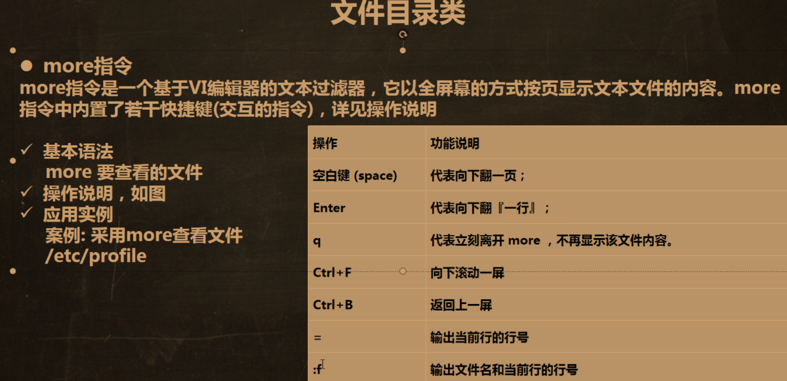
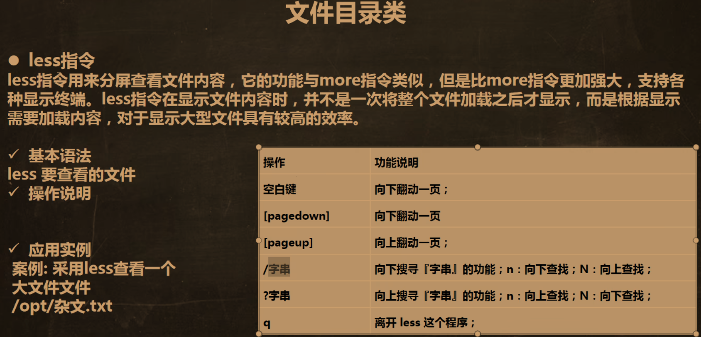
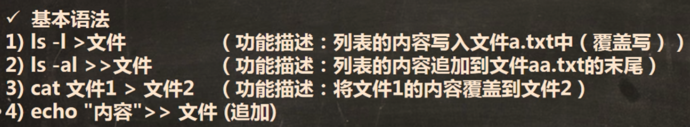

## 查看文件

| 命令 | 说明 |
|------|------|
| `cat 文件名` | 查看文件全部内容（只读） |
| `cat -n 文件名` | 显示行号 |
| `cat -n 文件名 \| more` | 分页显示（配合管道） |

## 分页查看

### more

`more` 可以单独使用，也可以和其他命令配合使用。



```
more 文件名
```

常用操作：**空格键**翻下一页，**Enter** 逐行下翻，**q** 退出。

### less

`less` 功能比 `more` 更强大。

> [!NOTE]
> **动态加载**：处理大文件时，只看哪一部分就加载哪一部分，耗费资源少，效率高（与 vim 对比）。



```
less 文件名
```

## 查看文件开头/结尾

| 命令 | 说明 |
|------|------|
| `head 文件名` | 默认显示前 10 行 |
| `head -n 行数 文件名` | 指定显示前 N 行 |
| `tail 文件名` | 默认显示后 10 行 |
| `tail -n 行数 文件名` | 指定显示后 N 行 |
| `tail -f 文件名` | **实时追踪**文档更新（按 `Ctrl + C` 退出） |

## 输出内容

| 命令 | 说明 |
|------|------|
| `echo "hello"` | 输出内容到控制台 |
| `echo $PATH` | 输出环境变量 |
| `echo $HOSTNAME` | 输出主机名称 |

## 输出重定向

| 符号 | 说明 |
|:----:|------|
| `>`  | **覆盖**写入到文件 |
| `>>` | **追加**到文件末尾 |



::: tip
`ls -l > 文件` 常用于将命令输出**保存为文件**或**复制粘贴**。
:::

## 筛选查找（grep）

| 命令 | 说明 |
|------|------|
| `grep -n "关键词" 文件名` | 在文件中查找关键词，显示行号 |
| `grep -i "关键词" 文件名` | 不区分大小写 |
| `cat 文件 \| grep "关键词"` | 通过管道筛选 |
| `grep "关键词\\|关键词2" 文件` | 同时查询**多个**关键词 |

```
例 1：cat /home/hello.txt | grep -n "hello"
例 2：grep -n "hello" /home/hello.txt
```

## 统计

| 命令 | 说明 |
|------|------|
| `wc -l 文件名` | 统计文件行数（常配合管道使用） |
