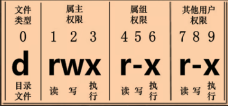
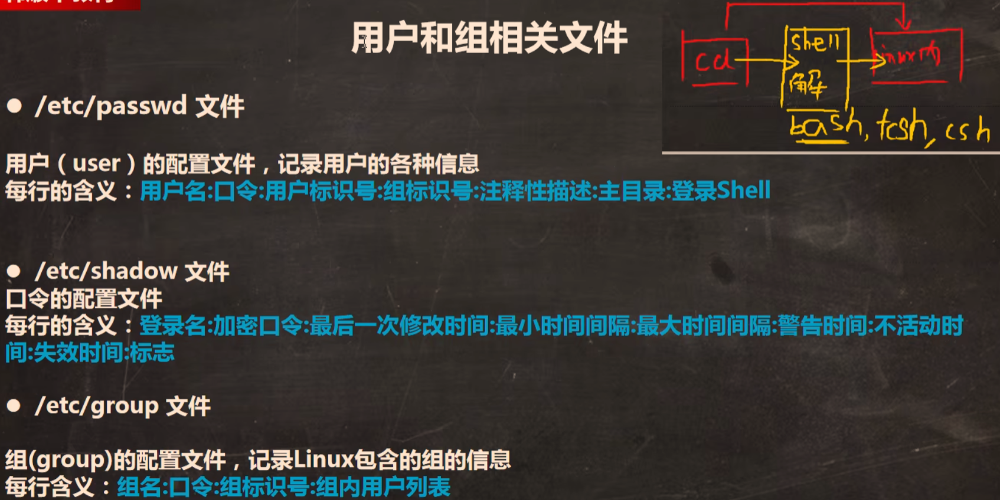

## 用户管理

### 添加用户

| 命令 | 说明 |
|------|------|
| `useradd 用户名` | 创建用户（默认在 `/home/用户名` 创建家目录） |
| `useradd -d /home/test phz` | 指定家目录创建用户 |

### 设置/修改密码

```
passwd 用户名
```

### 切换用户

```
su - 用户名
```

### 删除用户

| 命令 | 说明 |
|------|------|
| `userdel 用户名` | 删除用户（保留家目录，但已无法登录） |
| `userdel -r 用户名` | **彻底删除**用户及其家目录 |

### 用户信息查询

| 命令 | 说明 |
|------|------|
| `id 用户名` | 查看用户的 uid、gid 和所属组 |
| `who am i` | 查看当前登录用户的信息 |
| `pwd` | 显示当前用户所在目录 |

### 注销

| 命令 | 说明 |
|------|------|
| `logout` | 注销当前登录会话（**图形界面不可用**） |
| `exit` | 退出终端或当前会话 |

::: tip
`logout` 更专注于结束登录会话，`exit` 适用范围更广。在图形界面的终端中，使用 `exit` 退出终端。
:::

---

## 用户组管理

| 命令 | 说明 |
|------|------|
| `groupadd 组名` | 增加用户组 |
| `groupdel 组名` | 删除用户组 |
| `useradd -g 组名 用户名` | 创建用户并直接加入指定组 |
| `usermod -g 新组名 用户名` | 更改用户所在的组 |

---

## 文件权限管理

### 查看文件所有者

```
ls -ahl
```

### 更改文件所有者

| 命令 | 说明 |
|------|------|
| `chown 用户名 文件名` | 更改文件所有者 |
| `chown 用户名:组名 文件名` | 同时更改所有者和所在组 |
| `chown -R 用户名 目录` | **递归**改变目录及其下所有文件所有者 |

### 更改文件所在组

| 命令 | 说明 |
|------|------|
| `chgrp 组名 文件名` | 修改文件所在组 |
| `chgrp -R 组名 目录` | 递归修改目录及其下文件的所在组 |

### 修改文件权限（chmod）



**符号法：**

| 符号 | 含义 |
|:----:|------|
| `u` | 所有者 |
| `g` | 所在组 |
| `o` | 其他组 |
| `a` | 所有人 |
| `+` | 增加权限 |
| `-` | 去除权限 |
| `=` | 赋予权限 |

```
chmod u=rwx,g=rw,o=r 文件名
```

**数字法：**

| 权限 | 数字 |
|:----:|:----:|
| r（读） | 4 |
| w（写） | 2 |
| x（执行） | 1 |

> [!NOTE]
> 数字组合即可，最大为 7：
> - `rwx` = 4 + 2 + 1 = 7
> - `rw-` = 4 + 2 + 0 = 6
> - `r--` = 4 + 0 + 0 = 4

```
chmod 764 文件名
```

---

## 用户配置文件

使用 vim 查看以下文件可获取详细的用户/组信息：

| 文件 | 说明 |
|------|------|
| `/etc/passwd` | 用户信息配置：`用户名:口令:uid:gid:注释:主目录:登录Shell` |
| `/etc/shadow` | 用户口令配置：`登录名:加密口令:最后修改时间:最小间隔:最大间隔:警告时间:不活动:失效:标志` |
| `/etc/group` | 组信息配置：`组名:口令:gid:组内用户列表` |


