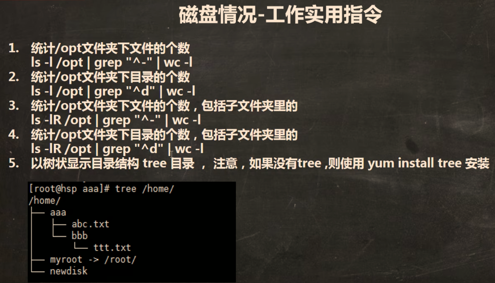

## 查看磁盘设备

| 命令 | 说明 |
|------|------|
| `lsblk` | 查看所有设备挂载情况 |
| `lsblk -f` | 详细查看所有设备挂载情况（含文件系统类型） |

## 磁盘分区（root 权限）


```
1. 查看磁盘情况：lsblk
2. 创建分区：fdisk /dev/sdb  → 按 m 显示命令列表
3. 格式化分区：mkfs -t ext4 /dev/sdb1
4. 挂载：mount /dev/sdb1 /newdisk
```

### 挂载与卸载

| 命令 | 说明 |
|------|------|
| `mount 分区名 目录名` | 将分区挂载到指定目录 |
| `umount 分区名 目录名` | 卸载分区与目录的关系 |

::: tip
`mount /dev/sdb1 /newdisk` — 将 `/dev/sdb1` 分区挂载到 `/newdisk` 目录
:::

## 磁盘使用情况

### 查看整体磁盘容量

```
df -h
```

> `-h` 以人类可读的方式显示（GB/MB）

### 查看目录占用空间

```
du -h
```


::: code-tabs
@tab:active 常用示例
```bash
# 查询 /opt 目录下的磁盘使用情况，深度为 1
du -hac --max-depth=1 /opt
```
:::

> `-h` 人类可读 / `-a` 显示所有文件和目录 / `-c` 显示总和

### 磁盘实用指令组合



```
# 统计 /opt 下的文件个数
ls -lR /opt | grep "^-" | wc -l
```

| 命令段 | 说明 |
|--------|------|
| `ls -lR` | 递归列出包括子目录 |
| `grep "^-"` | 筛选**文件**（文件类型开头为 `-`） |
| `grep "^d"` | 筛选**目录**（目录类型开头为 `d`） |
| `wc -l` | 统计行数（即个数） |

## 压缩与归档

### gzip / gunzip

| 命令 | 说明 |
|------|------|
| `gzip 文件` | 压缩文件为 `.gz`（仅适用于单个文件） |
| `gunzip 文件.gz` | 解压 `.gz` 文件 |

### zip / unzip

| 命令 | 说明 |
|------|------|
| `zip -r 文件名.zip 目标目录` | 递归压缩目录 |
| `unzip -d 指定目录 文件名.zip` | 解压到指定目录 |

```
# 将 /home 目录压缩为 myhome.zip
zip -r myhome.zip /home

# 将 myhome.zip 解压到 /opt/ttt 目录
unzip -d /opt/ttt /home/myhome.zip
```

### tar（最常用）

| 参数 | 说明 |
|:----:|------|
| `-z` | 通过 gzip 过滤归档 |
| `-c` | 创建归档文件 |
| `-x` | 解压归档文件 |
| `-v` | 显示详细信息 |
| `-f` | 指定归档文件名 |
| `-C` | 指定解压目标目录 |

```
# 压缩：tar -zcvf 文件名.tar.gz 被压缩的目标
tar -zcvf myarchive.tar.gz /home/test

# 解压：tar -zxvf 文件名.tar.gz -C 目标目录
tar -zxvf myarchive.tar.gz -C /opt
```

> [!TIP]
> `tar -zxvf` 是最常用的解压命令，几乎可以解压所有 `.tar.gz` 格式的文件。
