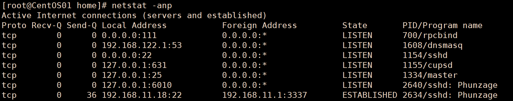
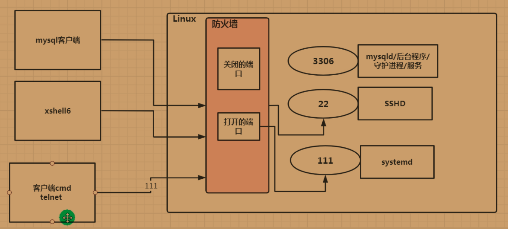

## 网络配置

| 命令 | 说明 |
|------|------|
| `ifconfig` | 查看当前网络接口的 IP 地址等信息 |

## 远程连接

| 命令 | 说明 |
|------|------|
| `ssh 用户名@IP地址` | 远程连接到另一台 Linux 服务器 |

```
ssh tom@192.168.200.130
```

## 监控网络状态

### netstat

| 命令 | 说明 |
|------|------|
| `netstat -an \| more` | 按一定顺序排列列出所有网络连接 |
| `netstat -anp` | 显示网络连接并标识调用进程 |
| `netstat -anp \| grep 进程名` | 筛选特定进程的网络连接 |



## 防火墙管理（firewall-cmd）

远程登录（如 telnet）成功的条件：
1. 防火墙关闭防护
2. 防火墙开启防护 **但** 防火墙内的端口已开放

### 防火墙端口操作

| 命令 | 说明 |
|------|------|
| `firewall-cmd --permanent --add-port=端口/协议` | 开放端口 |
| `firewall-cmd --permanent --remove-port=端口/协议` | 关闭端口 |
| `firewall-cmd --reload` | 重新载入防火墙配置 |
| `firewall-cmd --query-port=端口/协议` | 查询端口是否开放 |



> [!NOTE]
> 防火墙的开关使用 `systemctl` 控制（详见 [包管理与服务](./7.包管理与任务调度.md)）。

## 文件下载

| 命令 | 说明 |
|------|------|
| `wget 下载链接` | 从网络下载文件或资源 |
