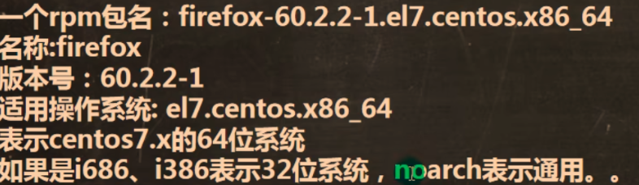
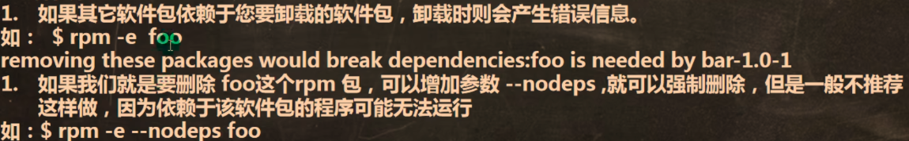
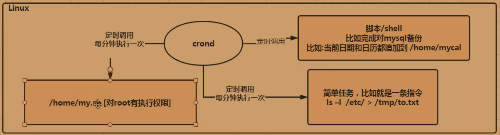
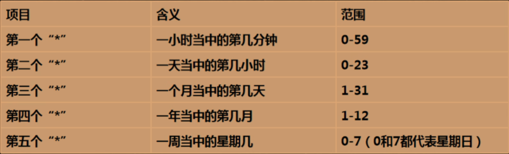
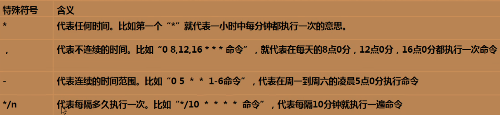
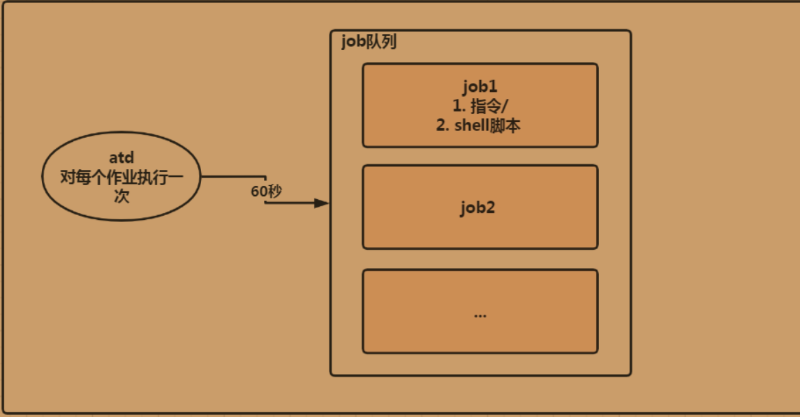
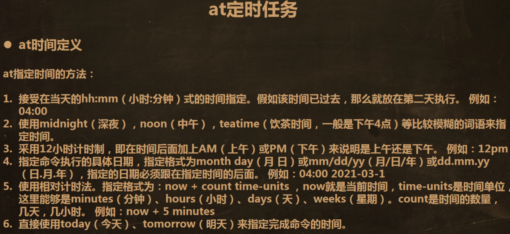

## RPM 包管理

### 查询软件包



| 命令 | 说明 |
|------|------|
| `rpm -qa \| grep 包名` | 查看系统是否安装了某软件 |
| `rpm -q 包名` | 同上（更简洁） |
| `rpm -qi 包名` | 查询软件包信息 |
| `rpm -ql 包名` | 查询软件包中的文件列表 |
| `rpm -qf 文件全路径` | 查询文件所属的软件包 |

### 安装与卸载



| 命令 | 说明 |
|------|------|
| `rpm -e 包名` | 卸载软件包 |
| `rpm -ivh rpm包全路径名` | 安装 rpm 软件包 |


::: tip
`-i` 安装 / `-v` 显示信息 / `-h` 显示进度条
:::

## YUM 包管理

| 命令 | 说明 |
|------|------|
| `yum list \| grep 软件名` | 查询 YUM 仓库是否有某软件 |
| `yum install 包名` | 安装软件（自动解决依赖） |

## 服务管理

### 查看服务

| 目录 | 说明 |
|------|------|
| `ls -l /etc/init.d` | 查看 `service` 类型的服务 |
| `ls -l /usr/lib/systemd/system` | 查看 `systemctl` 类型的服务 |

::: note
CentOS 7.0 之后，很多服务不再使用 `service`，而是使用 `systemctl`。
:::

### service 命令

```
service 服务名 start|stop|restart|reload|status
```

### systemctl 命令

```
systemctl list-unit-files | grep 服务名    # 查看开机启动状态
systemctl is-enabled 服务名                 # 查询是否开机自启

systemctl enable 服务名                     # 设为开机自启（永久）
systemctl disable 服务名                    # 取消开机自启（永久）

systemctl start|stop|restart|status 服务名  # 临时启动/停止/重启/查看状态
```

### 查看所有服务

```
setup
```

### chkconfig（管理服务启动级别）

| 命令 | 说明 |
|------|------|
| `chkconfig` | 查看服务在各运行级别的启动状态 |
| `chkconfig --list \| grep 筛选` | 查看筛选的服务 |
| `chkconfig --level 3 服务名 on/off` | 设置某级别下服务的开关（重启生效） |

### 运行级别

| 级别 | 对应名称 | 说明 |
|:----:|----------|------|
| 3 | `multi-user.target` | 命令行模式（常用） |
| 5 | `graphical.target` | 图形界面模式（常用） |

```
systemctl get-default                     # 查看当前运行级别
systemctl set-default multi-user.target   # 修改运行级别
```

## 任务调度

### crontab（循环执行）

**原理：**



| 命令 | 说明 |
|------|------|
| `crontab -e` | 编辑任务调度 |
| `crontab -l` | 列出当前用户的所有定时任务 |
| `crontab -r` | 删除当前用户的所有任务调度 |

**时间格式：**



```
* * * * * 要执行的命令
─ ─ ─ ─ ─
│ │ │ │ │
│ │ │ │ └── 星期 (0-7, 0和7都是周日)
│ │ │ └──── 月份 (1-12)
│ │ └────── 日期 (1-31)
│ └──────── 小时 (0-23)
└────────── 分钟 (0-59)
```



> [!TIP]
> 任务调度可以和 shell 脚本结合使用，实现更复杂的定时任务。

### at（一次性执行）

**原理：**



```
# 示例：2 分钟后执行任务
at now + 2 minutes
at> date > /home/date.txt
Ctrl + D 两次退出编辑
```

| 命令 | 说明 |
|------|------|
| `atq` | 查看未执行的 at 任务列表 |
| `atrm 任务编号` | 删除指定 at 任务 |


