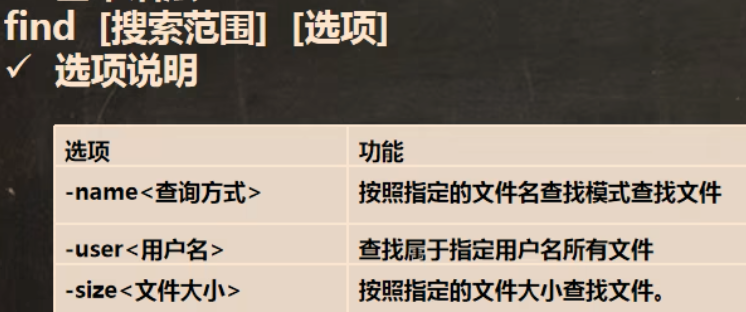

## 搜索命令

### find（功能强大，灵活搜索）



`find` 可以按文件名、文件大小、修改时间等多种条件搜索。

```
# 按文件名搜索（支持通配符）
find 搜索路径 -name "文件名"

# 按文件大小搜索
find 搜索路径 -size +100M     # 大于 100MB
find 搜索路径 -size -1M       # 小于 1MB

# 按修改时间搜索
find 搜索路径 -mtime -7       # 7 天内修改过的文件
```

### locate（快速定位）

| 命令 | 说明 |
|------|------|
| `locate 文件名` | 快速定位文件路径（基于数据库） |
| `updatedb` | 更新 locate 的路径数据库（首次使用前须执行） |

> [!NOTE]
> `locate` 基于预建的文件名数据库查询，速度极快。建议定期执行 `updatedb` 保持数据库最新。

### which（查找命令位置）

| 命令 | 说明 |
|------|------|
| `which 命令名` | 查看某个命令程序位于哪个目录 |

```
which ls    # 输出: /usr/bin/ls
which gcc   # 输出: /usr/bin/gcc
```

### grep（文件内容搜索）

| 命令 | 说明 |
|------|------|
| `grep "关键词" 文件名` | 在文件中搜索关键词 |
| `grep -n "关键词" 文件名` | 显示匹配行的行号 |
| `grep -i "关键词" 文件名` | 忽略大小写 |
| `command \| grep "关键词"` | 通过管道筛选命令行输出 |

```
# 示例：查看进程列表中是否包含 sshd
ps -aux | grep sshd
```

## 帮助命令

| 命令 | 说明 |
|------|------|
| `man 命令名` | 查看命令的详细手册（按 `q` 退出） |
| `命令名 --help` | 查看命令的简要帮助信息 |

> [!TIP]
> `man` 是查看命令用法的最佳途径，按 `/` 可以在手册内搜索，按 `q` 退出。

## 系统检测

| 命令 | 说明 |
|------|------|
| `gcc -v` | 检测 gcc 编译器是否安装并显示版本 |
